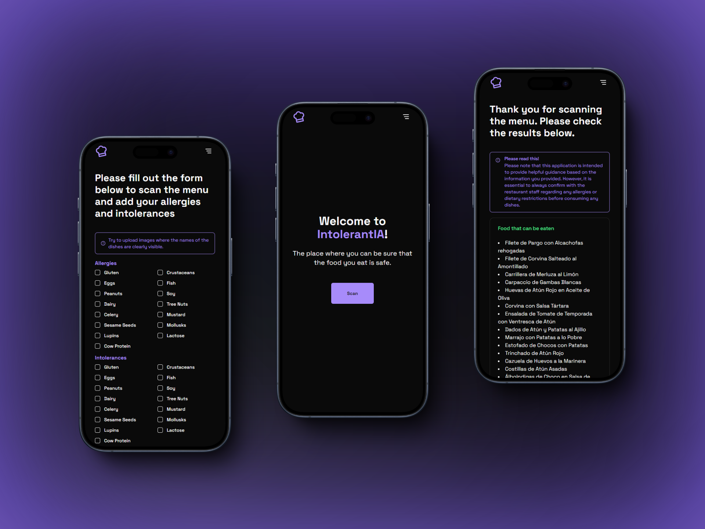
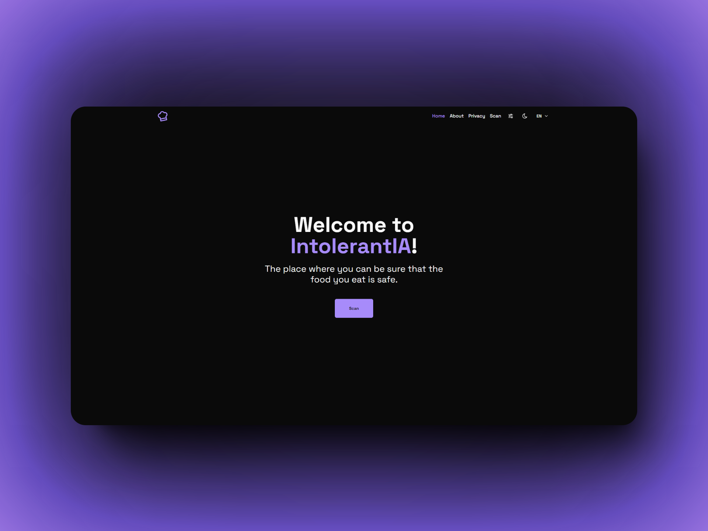

<a href="https://intolerantia.vercel.app" target="_blank" style="font-size: 30px;">
IntolerantIA
</a>


<details style="margin-top: 20px;">
  <summary>Table of Contents</summary>

- [Screenshots](#screenshots)
- [Website](#website)
- [To start](#to-start)
  - [Prerequisites](#prerequisites)
  - [Installation](#installation)

</details>

# Screenshots




# Website

If you want to see the website, you can visit [IntolerantIA](https://intolerantia.vercel.app).

# To start

## Prerequisites

- Node > 20 version. You can use [NVM](https://github.com/nvm-sh/nvm?tab=readme-ov-file#installing-and-updating) to setup a node version manager.

- Package manager
  - PNPM
    ```sh
    npm install -g pnpm
    ```

## Installation

1. Clone the repository
    ```sh
    git clone https://github.com/alevidals/intolerantIA.git
    ```

2. Install the packages (You can use `npm` or `yarn` instead of `pnpm` if you like)
    ```sh
    pnpm install
    ```

3. Execute the project (You can use `npm` or `yarn` instead of `pnpm` if you like)
    ```sh
    pnpm run dev